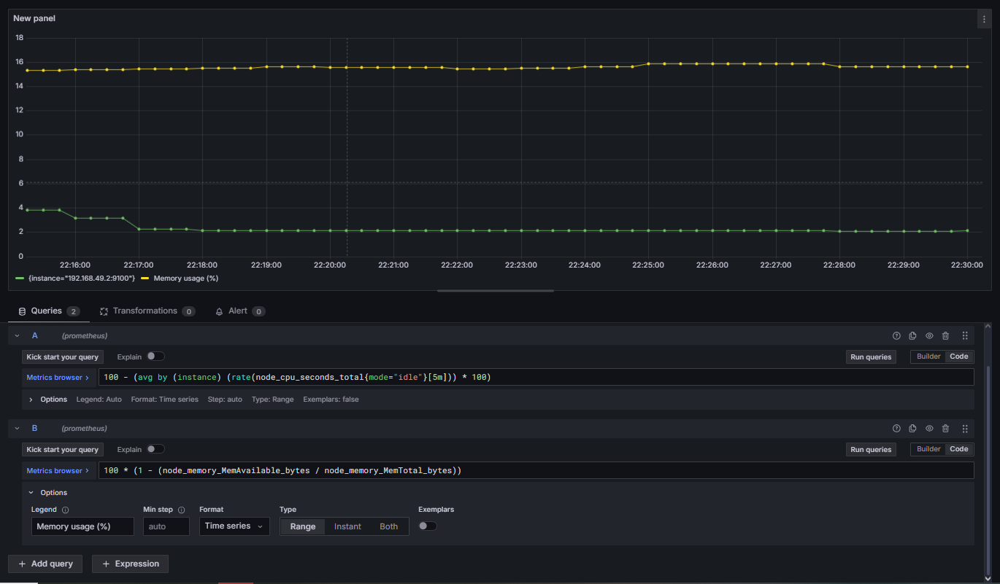

# DevOps-проект: Мониторинг ресурсов Kubernetes с Prometheus и Grafana

## Цель проекта
Настроить систему мониторинга кластера Kubernetes с использованием Prometheus и Grafana, а также отобразить метрики использования CPU, памяти (RAM) и диска.

---

## Этап 1. Развёртывание Prometheus и Grafana

Для начала был развёрнут кластер с помощью minikube, а затем установлены необходимые компоненты мониторинга:

```bash
minikube start
kubectl create namespace monitoring
helm install prometheus prometheus-community/kube-prometheus-stack -n monitoring
```

*Скриншот состояния сервисов Prometheus (Endpoints):*


---

## Этап 2. Проверка `deployment.yaml`

Далее был применён манифест `deployment.yaml`, который описывает деплой мониторинговых компонентов.

*Фрагмент кода deployment.yaml:*  


---


## Запуск в Minikube

После деплоя приложения, проверяем состояние подов:

```bash
kubectl get pods -A
```


## Этап 3. Метрики CPU

Метрика использует выражение:

```promql
100 - (avg by (instance) (rate(node_cpu_seconds_total{mode="idle"}[5m])) * 100)
```

*График загрузки CPU:*  


---

## Этап 4. Метрики памяти (Memory usage)

Метрика:

```promql
100 * (1 - (node_memory_MemAvailable_bytes / node_memory_MemTotal_bytes))
```

*График использования памяти:*  


---

## Этап 5. Метрики диска (Disk usage)

Для отслеживания дискового пространства используется:

```promql
100 - ((node_filesystem_avail_bytes{mountpoint="/"} * 100) / node_filesystem_size_bytes{mountpoint="/"})
```

*График использования диска:*  


---

## Этап 6. Настройка алертов

В Grafana были настроены алерты на превышение порогов нагрузки — например, при загрузке CPU выше 80%.

*Пример созданного алерта:*  


---


## CI-процесс (jenkins-build.sh)
Скрипт, имитирующий сборку Docker-образа:
```bash
./jenkins-build.sh
```


## Результат

В результате была настроена система мониторинга, позволяющая:

- Отслеживать использование ресурсов кластера Kubernetes;  
- Просматривать метрики CPU, RAM и диска в реальном времени;  
- Настраивать уведомления (Alerts) о превышении порогов нагрузки.

---

## Используемые технологии

| Компонент | Назначение |
|------------|------------|
| **Minikube** | Локальный кластер Kubernetes |
| **Prometheus** | Сбор метрик |
| **Grafana** | Визуализация данных |
| **Helm** | Установка чартов Prometheus stack |

---
